# Textual Guide


Above is the process for compiling and running MIPS programs on the LogiSpim processor that this guide will walk you through.
The steps necessary for each block of the flowchart are given by the following sections.

## MIPS Program
In order to run a program on LogiSpim, you must first have a program.
For MIPS assembly source code to be considered a LogiSpim program, it must satisfy a few conditions:
1. It must have a `main` label in the `.text` segment.
    * The `main` label serves as the entry point for a LogiSpim program.
    * To end the program's execution, the main program must return to the address stored in `$ra` following the initial jump to `main`.
2. It must only use `.text` and `.data` segments.
    * LogiSpim does not yet support more specialized segments such as `.rodata`.
3. It must conform to MIPS assembly standards while only using [instructions that are implemented by LogiSpim](../03_processor_overview/index.md).
    * LogiSpim does not yet support all valid MIPS instructions or syscall codes. Failure to follow this restriction will 
result in undefined behavior.
    * Any MIPS errors detected by the compiler or linker will result in a failure to compile and a subsequent popup
notification containing the cause.

Once all the above standards are met, a MIPS assembly source file can be executed by LogiSpim.

### Example
A simple example for a LogiSpim program is the following "Hello, world!" program.
```asm
    .data
str: .asciiz "Hello, world!"

    .text
main:           # Entry point to program denoted by "main" label
    la $a0, str
    li $v0, 4
    syscall     # Loads address to and prints str to the emulated console

    jr $ra      # Returns from the program, ending execution
```

## File Processor
The file processor program is specially built to compile LogiSpim programs that fit the criteria listed above into a form
that is easily imported into Logisim-Evolution to be executed.

We'll use the [example program](#example) from above saved to a file named `hello_world.s` to walk through
compilation with the file processor:
1. The first step is to launch the file processor application from its `.jar` file.
   This can be accomplished with the following command in your terminal or command prompt:
```shell
java -jar path/to/jar
```
After the file processor program has launched, it should look something like this:
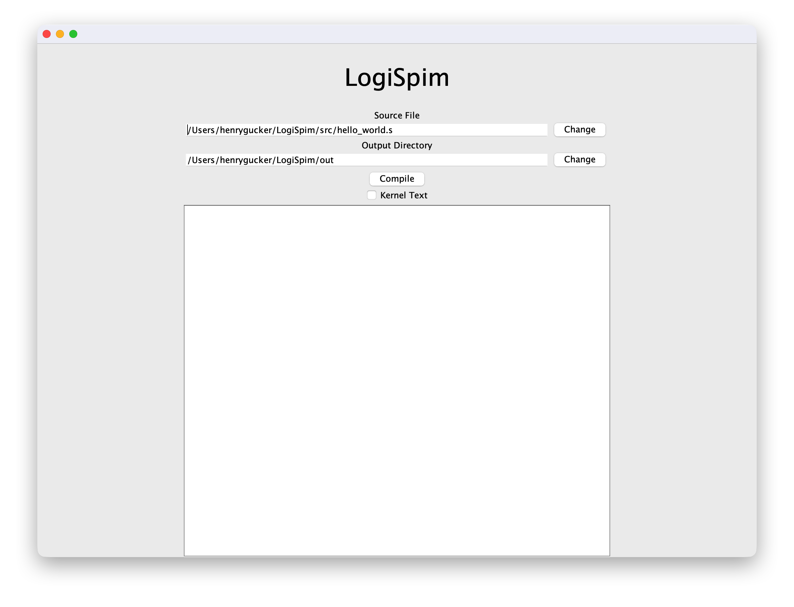
2. Select the source code file, in this case `hello_world.s`, by pressing the "Change" button.
   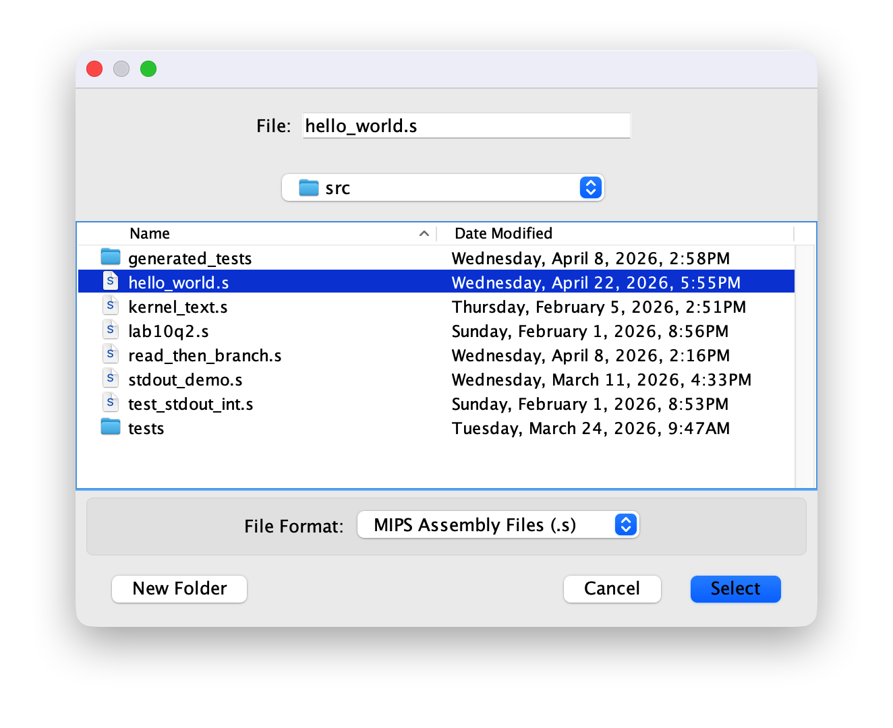
3. After selecting the source code file, observe that its contents are displayed in the text region with line numbers.
   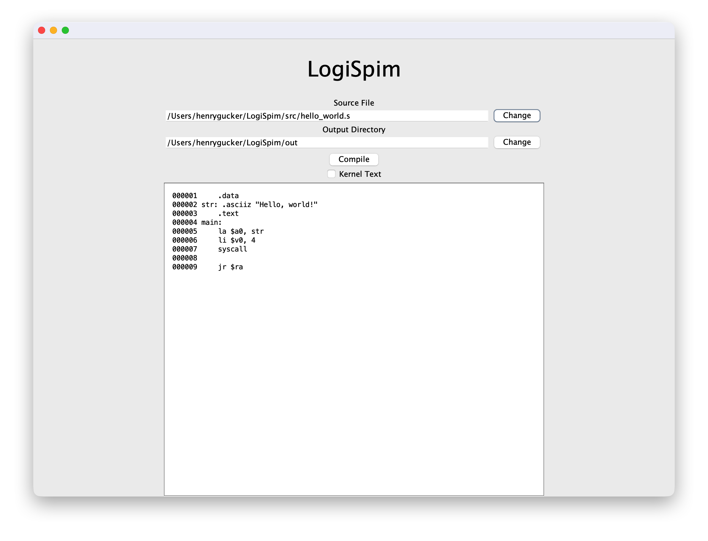
4. After ensuring that the "Kernel Text" checkbox is left empty and the output directory is where you'd like output files
   to go, press the "Compile" button to generate the files to be loaded into Logisim.
   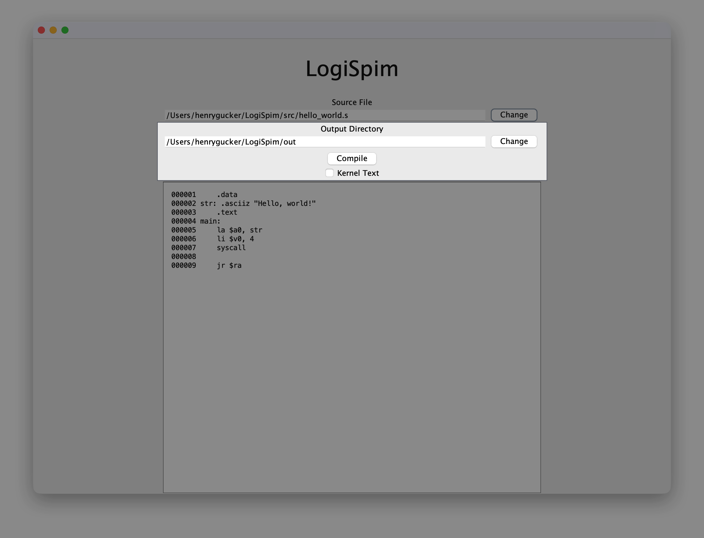
5. After a successful compilation, a popup window should notify you that output files were written to a directory within
   your selected output directory. *If your program did not utilize a `.data` section, a popup will notify you of that, but
   compilation will continue.*
   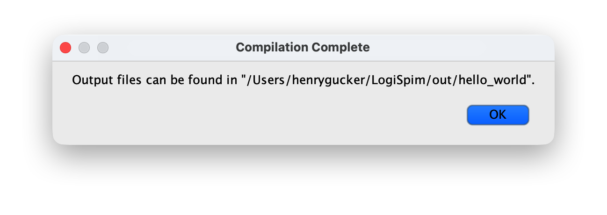
6. Finally, this should result in a disassembled version of the `.text` and `.data` sections
   being displayed in the text region.
   The memory addresses and hex values associated with instructions and data in this view matches those used by the processor.
   This allows it to serve as a helpful tool when debugging or using breakpoints.
   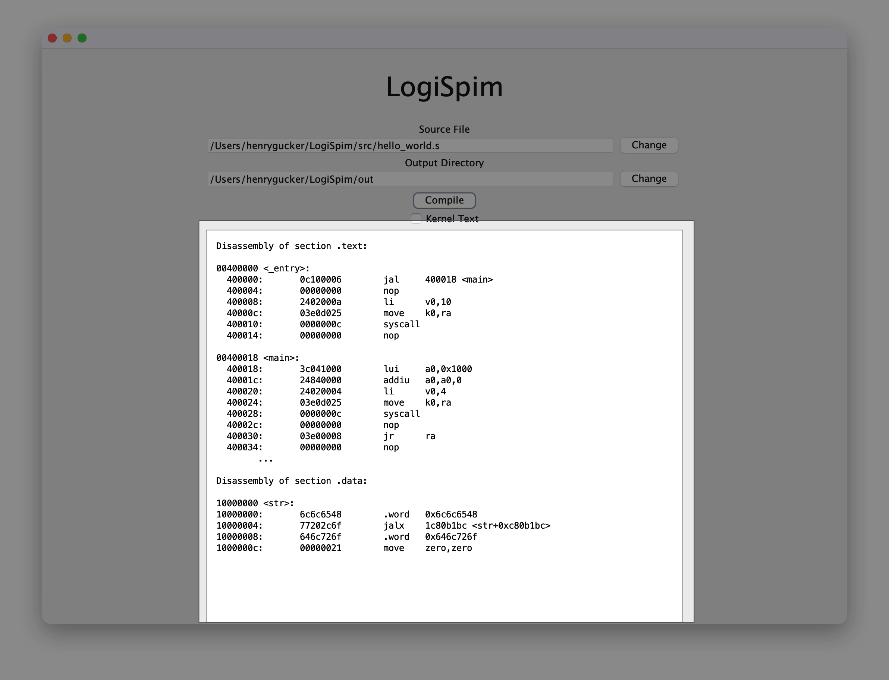
7. Upon inspecting the output directory from step 5 named after the source program, you should see a `text.hex` and a
   `data.hex` file. *If your program did not utilize a data segment, will not see a `data.hex` file.*
   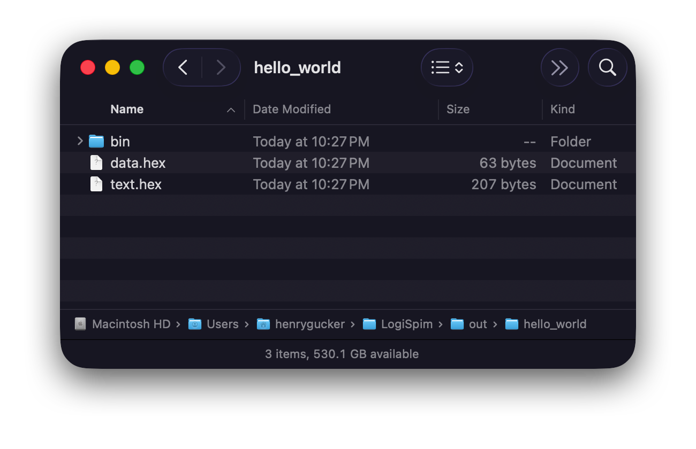


## Logisim Processor
The resulting `.hex` files from the file processor are what will be imported into the Logisim-Evolution circuit.
To do this, the following steps must be taken:
1. View the `InstructionMemory` sub-circuit and follow the instructions in large red text to load the `text.hex` file
   into the ROM module that represents the user memory segment.

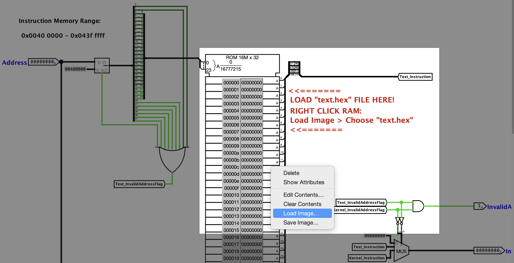

2. Return to the `main` circuit and find the `Main Memory` module in the Memory pipeline stage.
   Follow the instructions in the large red text next to the `data` RAM module to load the `data.hex` file.
   *Note that this step may need to be repeated after program execution if modifications are made to data in this segment.*

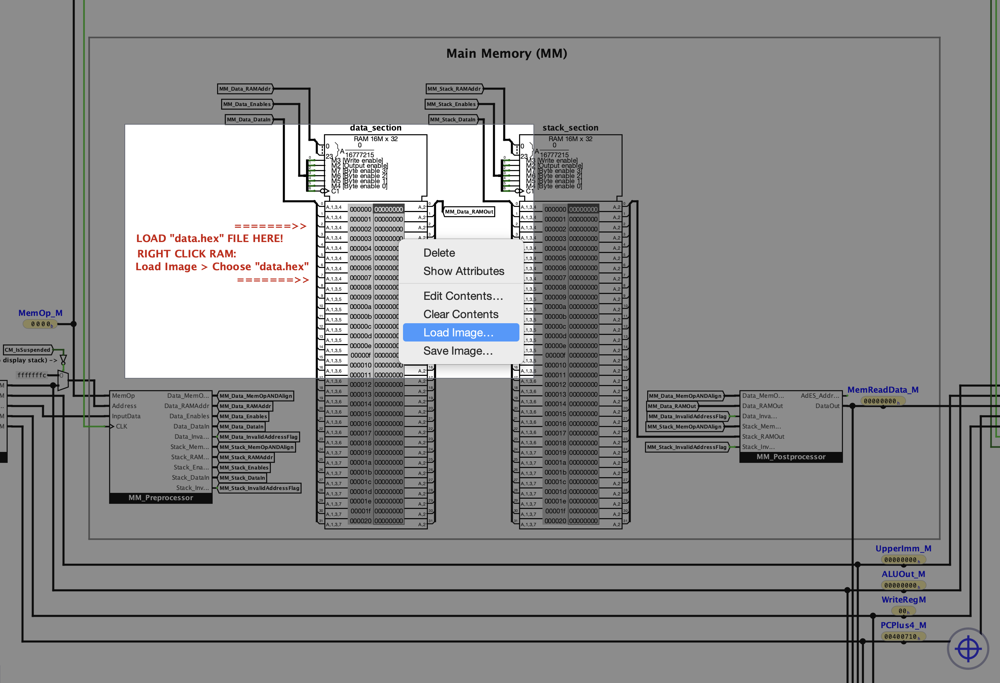

3. Now that the program is loaded, it's time to run the program!
   To do so, return to the upper-left corner of the main circuit and view the user control panel. Then, set the auto-tick
   clock frequency of Logisim to your desired frequency through the `Simulate > Auto-Tick Frequency` dropdown menu.

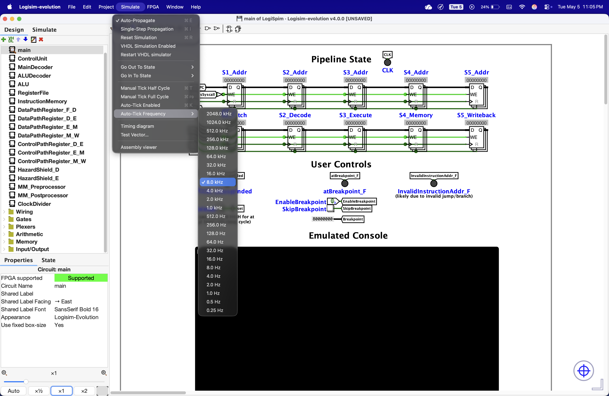

> [!WARNING]
> The LogiSpim CPU uses a 512:1 clock divider when executing user instructions, and the Auto. So the effective clock frequency
> of a `8.0 kHz` Auto-Tick frequency is `8 Hz`.

4. Enable the Auto-Ticking and hold the "Reset" button on the control panel down for at least one full clock cycle.
   Once released, the program will run until it exits.
   For the `hello_world.s` program, the resulting state with the printed "Hello, world!" is pictured below:

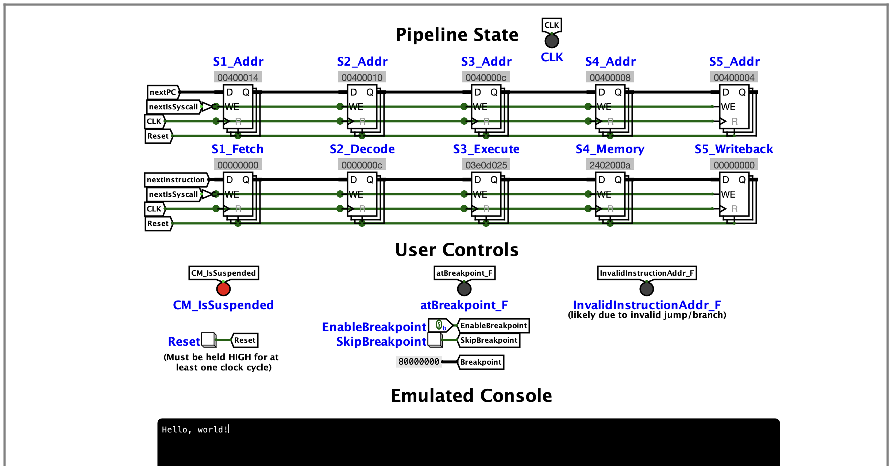


Moreover, it is possible to view the state of all registers at any given point by de-selecting any components, and
looking at the "State" tab in the bottom left to view all registers and their contents.

