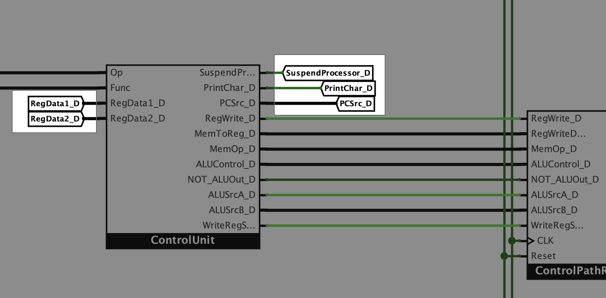

### What are the "Tunnel" components?
Tunnels are used all across the LogiSpim processor circuit.
They allow for transmission of signals without direct wires between them, decreasing clutter in complicated circuits.

**Any two tunnels that share the same name are connected.**
However, this fact can cause a lot of complexity as circuits grow.
To avoid this, LogiSpim has an established convention for naming tunnels:

* In the LogiSpim main circuit, all main signals have a suffix corresponding to the pipeline stage they originate from.
  * Example: As is seen in the picture above, the signal carrying the `PCSrc` control path signal in the decode stage of the pipeline is referred to
  as `PCSrc_D`.

* Tunnels carrying signals internal to specific components that exist directly in the main circuit—such as Main Memory
or the Clock Divider—are named with a prefix corresponding to the component they originate from.
  * Example: the Clock Divider outputs a signal, `IsSuspended`, signalling if the processor has suspended execution.
  Since the Clock Manager has the abbreviation `CM`, this signal is accessed through tunnels named `CM_IsSuspended`.
