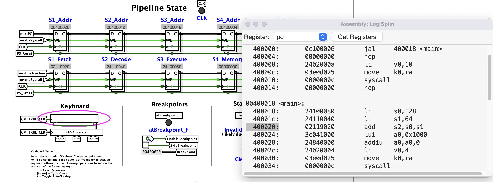
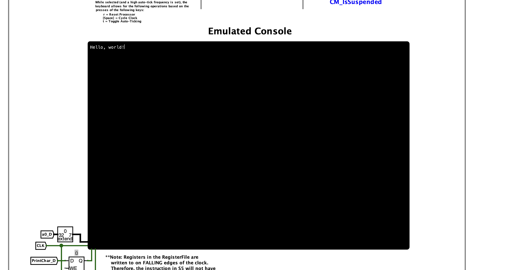
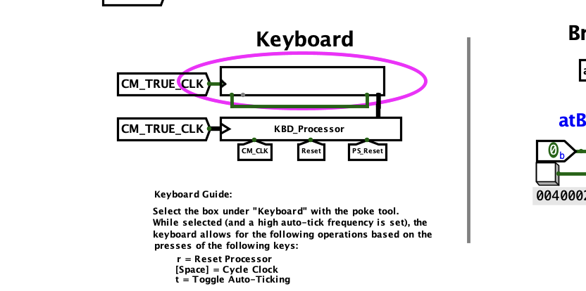
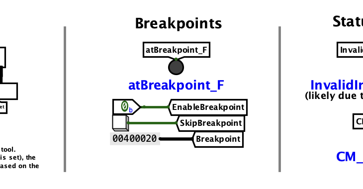

# Overview

The Logisim processor allows users to run MIPS assembly code on exposed circuitry.
This enables interactive learning about processor microarchitecture and the standard 5-stage RISC pipelining with real
MIPS programs.
Moreover, it includes support for features improving user experience such as keyboard-driven clock controls,
breakpoints, an emulated kernel for console output via syscalls, and support for utilizing Logisim's assembly view.
More details about these features can be found below.
## Key Features
### Assembly Viewer

LogiSpim provides support for usage of the assembly viewer feature in Logisim-evolution.
This viewer allows for the line of the object dump corresponding to the current instruction to be highlighted and
displayed at all times.

### Emulated Console

The emulated console allows for user code to print integers, strings, and characters for program output as pictured below:

### Keyboard-Driven Controls

Through the built-in keyboard component in Logisim-evolution, control over the clock with keyboard inputs is supported.
This supports the ability to:
- reset the processor by pressing `r`.
- step through one clock cycle by pressing `space`.
- toggle allowing the program to run at the set clock rate by pressing `t`.

### Breakpoints

The breakpoint system allows users to set a breakpoint at an instruction address of their choosing, heavily aiding in
debugging.

## Supported Instructions
<!--suppress CssUnresolvedCustomProperty -->

The instruction set implemented in this processor was based on [this MIPS reference sheet](https://booksite.elsevier.com/9780124077263/downloads/COD_5e_Greencard.pdf).

<table>
    <thead>
        <tr> <th>OP/Funct</th> <th>I-Type & J-Type Instructions</th> <th>R-Type Instructions</th> </tr>
    </thead>
<tbody><tr>
    <td style="padding: 0 0; border: 0 white solid">
        <table>
            <thead>
                <tr> <th>#</th> <th>Binary</th> </tr>
            </thead>
            <tbody>
                <tr> <td>0</td>  <td style="white-space: nowrap">0000 00</td></tr>
                <tr> <td>1</td>  <td>0000 01</td></tr>
                <tr> <td>2</td>  <td>0000 10</td></tr>
                <tr> <td>3</td>  <td>0000 11</td></tr>
                <tr> <td>4</td>  <td>0001 00</td></tr>
                <tr> <td>5</td>  <td>0001 01</td></tr>
                <tr> <td>6</td>  <td>0001 10</td></tr>
                <tr> <td>7</td>  <td>0001 11</td></tr>
                <tr> <td>8</td>  <td>0010 00</td></tr>
                <tr> <td>9</td>  <td>0010 01</td></tr>
                <tr> <td>10</td> <td>0010 10</td></tr>
                <tr> <td>11</td> <td>0010 11</td></tr>
                <tr> <td>12</td> <td>0011 00</td></tr>
                <tr> <td>13</td> <td>0011 01</td></tr>
                <tr> <td>14</td> <td>0011 10</td></tr>
                <tr> <td>15</td> <td>0011 11</td></tr>
                <tr> <td>16</td> <td>0100 00</td></tr>
                <tr> <td>17</td> <td>0100 01</td></tr>
                <tr> <td>18</td> <td>0100 10</td></tr>
                <tr> <td>19</td> <td>0100 11</td></tr>
                <tr> <td>20</td> <td>0101 00</td></tr>
                <tr> <td>21</td> <td>0101 01</td></tr>
                <tr> <td>22</td> <td>0101 10</td></tr>
                <tr> <td>23</td> <td>0101 11</td></tr>
                <tr> <td>24</td> <td>0110 00</td></tr>
                <tr> <td>25</td> <td>0110 01</td></tr>
                <tr> <td>26</td> <td>0110 10</td></tr>
                <tr> <td>27</td> <td>0110 11</td></tr>
                <tr> <td>28</td> <td>0111 00</td></tr>
                <tr> <td>29</td> <td>0111 01</td></tr>
                <tr> <td>30</td> <td>0111 10</td></tr>
                <tr> <td>31</td> <td>0111 11</td></tr>
                <tr> <td>32</td> <td>1000 00</td></tr>
                <tr> <td>33</td> <td>1000 01</td></tr>
                <tr> <td>34</td> <td>1000 10</td></tr>
                <tr> <td>35</td> <td>1000 11</td></tr>
                <tr> <td>36</td> <td>1001 00</td></tr>
                <tr> <td>37</td> <td>1001 01</td></tr>
                <tr> <td>38</td> <td>1001 10</td></tr>
                <tr> <td>39</td> <td>1001 11</td></tr>
                <tr> <td>40</td> <td>1010 00</td></tr>
                <tr> <td>41</td> <td>1010 01</td></tr>
                <tr> <td>42</td> <td>1010 10</td></tr>
                <tr> <td>43</td> <td>1010 11</td></tr>
                <tr> <td>44</td> <td>1011 00</td></tr>
                <tr> <td>45</td> <td>1011 01</td></tr>
                <tr> <td>46</td> <td>1011 10</td></tr>
                <tr> <td>47</td> <td>1011 11</td></tr>
                <tr> <td>48</td> <td>1100 00</td></tr>
                <tr> <td>49</td> <td>1100 01</td></tr>
                <tr> <td>50</td> <td>1100 10</td></tr>
                <tr> <td>51</td> <td>1100 11</td></tr>
                <tr> <td>52</td> <td>1101 00</td></tr>
                <tr> <td>53</td> <td>1101 01</td></tr>
                <tr> <td>54</td> <td>1101 10</td></tr>
                <tr> <td>55</td> <td>1101 11</td></tr>
                <tr> <td>56</td> <td>1110 00</td></tr>
                <tr> <td>57</td> <td>1110 01</td></tr>
                <tr> <td>58</td> <td>1110 10</td></tr>
                <tr> <td>59</td> <td>1110 11</td></tr>
                <tr> <td>60</td> <td>1111 00</td></tr>
                <tr> <td>61</td> <td>1111 01</td></tr>
                <tr> <td>62</td> <td>1111 10</td></tr>
                <tr> <td>63</td> <td>1111 11</td></tr>
            </tbody>
        </table>
    </td>
    <td style="padding: 0 0; border: 0 white solid">
        <table>
            <thead>
                <tr> <th>Name</th> <th></th> <th>Note</th> </tr>
            </thead>
            <tbody>
                <tr> <td style="white-space: nowrap">R-Type</td> <td class="in-progress"></td> <td>See Table</td> </tr>
                <tr> <td></td> <td>&ZeroWidthSpace;</td> <td></td> </tr>
                <tr> <td><code>j</code></td> <td class="implemented"></td> <td>Implemented</td> </tr>
                <tr> <td><code>jal</code></td> <td class="implemented"></td> <td>Implemented</td> </tr>
                <tr> <td><code>beq</code></td> <td class="implemented"></td> <td>Implemented</td> </tr>
                <tr> <td><code>bne</code></td> <td class="implemented"></td> <td>Implemented</td> </tr>
                <tr> <td><code>blez</code></td> <td class="implemented"></td> <td>Implemented</td> </tr>
                <tr> <td><code>bgtz</code></td> <td class="implemented"></td> <td>Implemented</td> </tr>
                <tr> <td><code>addi</code></td> <td class="implemented"></td> <td>Implemented</td> </tr>
                <tr> <td><code>addiu</code></td> <td class="implemented"></td> <td>Implemented</td> </tr>
                <tr> <td><code>slti</code></td> <td class="implemented"></td> <td>Implemented</td> </tr>
                <tr> <td><code>sltiu</code></td> <td class="implemented"></td> <td>Implemented</td> </tr>
                <tr> <td><code>andi</code></td> <td class="implemented"></td> <td>Implemented</td> </tr>
                <tr> <td><code>ori</code></td> <td class="implemented"></td> <td>Implemented</td> </tr>
                <tr> <td><code>xori</code></td> <td class="implemented"></td> <td>Implemented</td> </tr>
                <tr> <td><code>lui</code></td> <td class="implemented"></td> <td>Implemented</td> </tr>
                <tr> <td></td> <td>&ZeroWidthSpace;</td> <td></td> </tr>
                <tr> <td>F-Type</td> <td class="not-implemented"></td> <td style="white-space: nowrap">Not Yet Implemented</td> </tr>
                <tr> <td></td> <td>&ZeroWidthSpace;</td> <td></td> </tr>
                <tr> <td></td> <td>&ZeroWidthSpace;</td> <td></td> </tr>
                <tr> <td></td> <td>&ZeroWidthSpace;</td> <td></td> </tr>
                <tr> <td></td> <td>&ZeroWidthSpace;</td> <td></td> </tr>
                <tr> <td></td> <td>&ZeroWidthSpace;</td> <td></td> </tr>
                <tr> <td></td> <td>&ZeroWidthSpace;</td> <td></td> </tr>
                <tr> <td></td> <td>&ZeroWidthSpace;</td> <td></td> </tr>
                <tr> <td></td> <td>&ZeroWidthSpace;</td> <td></td> </tr>
                <tr> <td></td> <td>&ZeroWidthSpace;</td> <td></td> </tr>
                <tr> <td></td> <td>&ZeroWidthSpace;</td> <td></td> </tr>
                <tr> <td></td> <td>&ZeroWidthSpace;</td> <td></td> </tr>
                <tr> <td></td> <td>&ZeroWidthSpace;</td> <td></td> </tr>
                <tr> <td></td> <td>&ZeroWidthSpace;</td> <td></td> </tr>
                <tr> <td></td> <td>&ZeroWidthSpace;</td> <td></td> </tr>
                <tr> <td><code>lb</code></td> <td class="implemented"></td> <td>Implemented</td> </tr>
                <tr> <td><code>lh</code></td> <td class="implemented"></td> <td>Implemented</td> </tr>
                <tr> <td><code>lwl</code></td> <td class="implemented"></td> <td>Implemented</td> </tr>
                <tr> <td><code>lw</code></td> <td class="implemented"></td> <td>Implemented</td> </tr>
                <tr> <td><code>lbu</code></td> <td class="implemented"></td> <td>Implemented</td> </tr>
                <tr> <td><code>lhu</code></td> <td class="implemented"></td> <td>Implemented</td> </tr>
                <tr> <td><code>lwr</code></td> <td class="implemented"></td> <td>Implemented</td> </tr>
                <tr> <td></td> <td>&ZeroWidthSpace;</td> <td></td> </tr>
                <tr> <td><code>sb</code></td> <td class="implemented"></td> <td>Implemented</td> </tr>
                <tr> <td><code>sh</code></td> <td class="implemented"></td> <td>Implemented</td> </tr>
                <tr> <td><code>swl</code></td> <td class="implemented"></td> <td>Implemented</td> </tr>
                <tr> <td><code>sw</code></td> <td class="implemented"></td> <td>Implemented</td> </tr>
                <tr> <td></td> <td>&ZeroWidthSpace;</td> <td></td> </tr>
                <tr> <td></td> <td>&ZeroWidthSpace;</td> <td></td> </tr>
                <tr> <td><code>swr</code></td> <td class="implemented"></td> <td>Implemented</td> </tr>
                <tr> <td><code>cache</code></td> <td class="not-implemented"></td> <td>Not Yet Implemented</td> </tr>
                <tr> <td><code>ll</code></td> <td class="not-implemented"></td> <td>Not Yet Implemented</td> </tr>
                <tr> <td><code>lwc1</code></td> <td class="not-implemented"></td> <td>Not Yet Implemented</td> </tr>
                <tr> <td><code>lwc2</code></td> <td class="not-implemented"></td> <td>Not Yet Implemented</td> </tr>
                <tr> <td><code>pref</code></td> <td class="not-implemented"></td> <td>Not Yet Implemented</td> </tr>
                <tr> <td></td> <td>&ZeroWidthSpace;</td> <td></td> </tr>
                <tr> <td><code>ldc1</code></td> <td class="not-implemented"></td> <td>Not Yet Implemented</td> </tr>
                <tr> <td><code>ldc2</code></td> <td class="not-implemented"></td> <td>Not Yet Implemented</td> </tr>
                <tr> <td></td> <td>&ZeroWidthSpace;</td> <td></td> </tr>
                <tr> <td><code>sc</code></td> <td class="not-implemented"></td> <td>Not Yet Implemented</td> </tr>
                <tr> <td><code>swc1</code></td> <td class="not-implemented"></td> <td>Not Yet Implemented</td> </tr>
                <tr> <td><code>swc2</code></td> <td class="not-implemented"></td> <td>Not Yet Implemented</td> </tr>
                <tr> <td></td> <td>&ZeroWidthSpace;</td> <td></td> </tr>
                <tr> <td></td> <td>&ZeroWidthSpace;</td> <td></td> </tr>
                <tr> <td><code>sdc1</code></td> <td class="not-implemented"></td> <td>Not Yet Implemented</td> </tr>
                <tr> <td><code>sdc2</code></td> <td class="not-implemented"></td> <td>Not Yet Implemented</td> </tr>
                <tr> <td></td> <td>&ZeroWidthSpace;</td> <td></td> </tr>
            </tbody>
        </table>
    </td>
    <td style="padding: 0 0; border: 0 white solid">
        <table>
            <thead>
                <tr> <th>Name</th> <th></th> <th>Note</th> </tr>
            </thead>
            <tbody>
                <tr> <td><code>sll</code></td> <td class="implemented"></td> <td>Implemented</td> </tr>
                <tr> <td></td> <td>&ZeroWidthSpace;</td> <td></td> </tr>
                <tr> <td><code>srl</code></td> <td class="implemented"></td> <td>Implemented</td> </tr>
                <tr> <td><code>sra</code></td> <td class="implemented"></td> <td>Implemented</td> </tr>
                <tr> <td><code>sllv</code></td> <td class="implemented"></td> <td>Implemented</td> </tr>
                <tr> <td></td> <td>&ZeroWidthSpace;</td> <td></td> </tr>
                <tr> <td><code>srlv</code></td> <td class="implemented"></td> <td>Implemented</td> </tr>
                <tr> <td><code>srav</code></td> <td class="implemented"></td> <td>Implemented</td> </tr>
                <tr> <td><code>jr</code></td> <td class="implemented"></td> <td>Implemented</td> </tr>
                <tr> <td><code>jalr</code></td> <td class="implemented"></td> <td>Implemented</td> </tr>
                <tr> <td><code>movz</code></td> <td class="not-implemented"></td> <td>Not Yet Implemented</td> </tr>
                <tr> <td><code>movn</code></td> <td class="not-implemented"></td> <td>Not Yet Implemented</td> </tr>
                <tr> <td><code>syscall</code></td> <td class="implemented"></td> <td>Implemented<a href="#footnote1">*</a></td> </tr>
                <tr> <td><code>break</code></td> <td class="not-implemented"></td> <td style="white-space: nowrap">Not Yet Implemented</td> </tr>
                <tr> <td></td> <td>&ZeroWidthSpace;</td> <td></td> </tr>
                <tr> <td><code>sync</code></td> <td class="not-implemented"></td> <td>Not Yet Implemented</td> </tr>
                <tr> <td><code>mfhi</code></td> <td class="implemented"></td> <td>Implemented</td> </tr>
                <tr> <td><code>mthi</code></td> <td class="implemented"></td> <td>Implemented</td> </tr>
                <tr> <td><code>mflo</code></td> <td class="implemented"></td> <td>Implemented</td> </tr>
                <tr> <td><code>mtlo</code></td> <td class="implemented"></td> <td>Implemented</td> </tr>
                <tr> <td></td> <td>&ZeroWidthSpace;</td> <td></td> </tr>
                <tr> <td></td> <td>&ZeroWidthSpace;</td> <td></td> </tr>
                <tr> <td></td> <td>&ZeroWidthSpace;</td> <td></td> </tr>
                <tr> <td></td> <td>&ZeroWidthSpace;</td> <td></td> </tr>
                <tr> <td><code>mult</code></td> <td class="implemented"></td> <td>Implemented</td> </tr>
                <tr> <td><code>multu</code></td> <td class="implemented"></td> <td>Implemented</td> </tr>
                <tr> <td><code>div</code></td> <td class="implemented"></td> <td>Implemented</td> </tr>
                <tr> <td><code>divu</code></td> <td class="implemented"></td> <td>Implemented</td> </tr>
                <tr> <td></td> <td>&ZeroWidthSpace;</td> <td></td> </tr>
                <tr> <td></td> <td>&ZeroWidthSpace;</td> <td></td> </tr>
                <tr> <td></td> <td>&ZeroWidthSpace;</td> <td></td> </tr>
                <tr> <td></td> <td>&ZeroWidthSpace;</td> <td></td> </tr>
                <tr> <td><code>add</code></td> <td class="implemented"></td> <td>Implemented</td> </tr>
                <tr> <td><code>addu</code></td> <td class="implemented"></td> <td>Implemented</td> </tr>
                <tr> <td><code>sub</code></td> <td class="implemented"></td> <td>Implemented</td> </tr>
                <tr> <td><code>subu</code></td> <td class="implemented"></td> <td>Implemented</td> </tr>
                <tr> <td><code>and</code></td> <td class="implemented"></td> <td>Implemented</td> </tr>
                <tr> <td><code>or</code></td> <td class="implemented"></td> <td>Implemented</td> </tr>
                <tr> <td><code>xor</code></td> <td class="implemented"></td> <td>Implemented</td> </tr>
                <tr> <td><code>nor</code></td> <td class="implemented"></td> <td>Implemented</td> </tr>
                <tr> <td></td> <td>&ZeroWidthSpace;</td> <td></td> </tr>
                <tr> <td></td> <td>&ZeroWidthSpace;</td> <td></td> </tr>
                <tr> <td><code>slt</code></td> <td class="implemented"></td> <td>Implemented</td> </tr>
                <tr> <td><code>sltu</code></td> <td class="implemented"></td> <td>Implemented</td> </tr>
                <tr> <td></td> <td>&ZeroWidthSpace;</td> <td></td> </tr>
                <tr> <td></td> <td>&ZeroWidthSpace;</td> <td></td> </tr>
                <tr> <td></td> <td>&ZeroWidthSpace;</td> <td></td> </tr>
                <tr> <td></td> <td>&ZeroWidthSpace;</td> <td></td> </tr>
                <tr> <td><code>tge</code></td> <td class="not-implemented"></td> <td>Not Yet Implemented</td> </tr>
                <tr> <td><code>tgeu</code></td> <td class="not-implemented"></td> <td>Not Yet Implemented</td> </tr>
                <tr> <td><code>tlt</code></td> <td class="not-implemented"></td> <td>Not Yet Implemented</td> </tr>
                <tr> <td><code>tltu</code></td> <td class="not-implemented"></td> <td>Not Yet Implemented</td> </tr>
                <tr> <td><code>teq</code></td> <td class="not-implemented"></td> <td>Not Yet Implemented</td> </tr>
                <tr> <td></td> <td>&ZeroWidthSpace;</td> <td></td> </tr>
                <tr> <td><code>tne</code></td> <td class="not-implemented"></td> <td>Not Yet Implemented</td> </tr>
                <tr> <td></td> <td>&ZeroWidthSpace;</td> <td></td> </tr>
                <tr> <td></td> <td>&ZeroWidthSpace;</td> <td></td> </tr>
                <tr> <td></td> <td>&ZeroWidthSpace;</td> <td></td> </tr>
                <tr> <td></td> <td>&ZeroWidthSpace;</td> <td></td> </tr>
                <tr> <td></td> <td>&ZeroWidthSpace;</td> <td></td> </tr>
                <tr> <td></td> <td>&ZeroWidthSpace;</td> <td></td> </tr>
                <tr> <td></td> <td>&ZeroWidthSpace;</td> <td></td> </tr>
                <tr> <td></td> <td>&ZeroWidthSpace;</td> <td></td> </tr>
                <tr> <td></td> <td>&ZeroWidthSpace;</td> <td></td> </tr>
            </tbody>
        </table>
    </td>
</tr></tbody>
</table>

* The <code>syscall</code> instruction has a <code>move $k0, $ra</code> instruction inserted prior to it by the pre-processor.
This is done to allow for <code>syscall</code> to preserve the value in <code>$ra</code>, since <code>syscall</code>
acts similarly to a <code>jal</code> instruction; despite the convention placing the responsibility of preserving
the content of <code>$ra</code> on the callee.
<i>Future improvements may remove the need for this additional instruction's insertion.</i>

