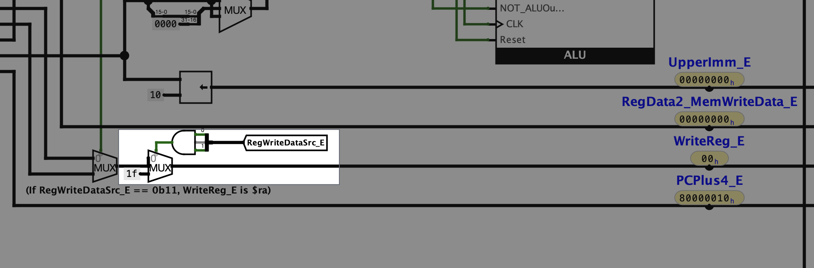
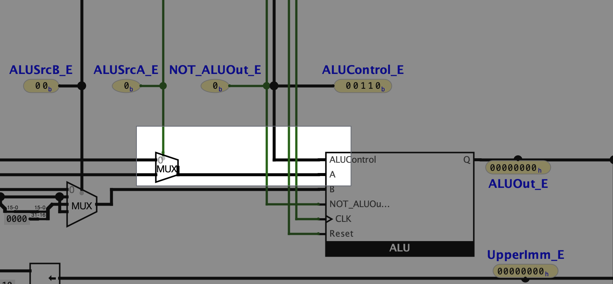
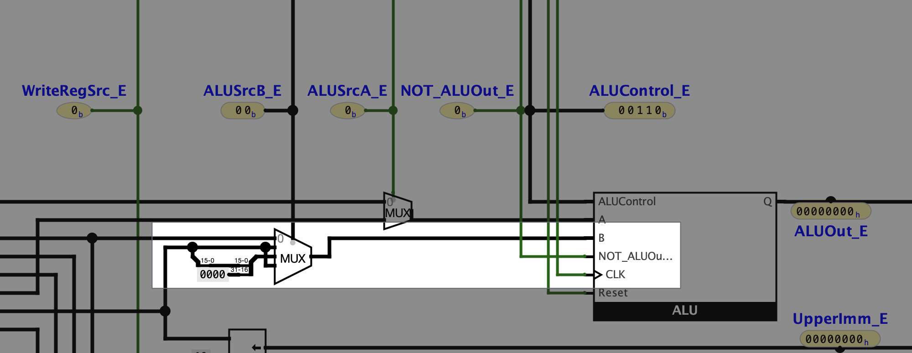

## Purpose
The Main Decoder lives inside the Control Unit, where it is the primary step for decoding instructions.
While the goal of the Control Unit is to map instructions to signals in the control path,
some of the Main Decoder's outputs are further processed by the rest of the Control Unit before becoming the signals present
in the control path.

The goal of the Main Decoder is to decode (primarily non-R-Type) instructions based on their `OP` codes.
However, the implementation of specific R-Type instructions has resulted in some of the Main Decoder's outputs being
overridden internally for specific `Funct` values when the `OP` code is `0` (R-Type).

## Output Documentation

Below is a description of what each output of the MainDecoder does.

### RegWrite

Relevant Pipeline Stages: `(5) Writeback` 
Bit Width: `1` 
Category: `Flag`

This is a flag indicating if an instruction will write to a register during the falling edge of the clock while the
instruction is in pipeline stage `(5) Writeback`.
This flag is passed into the `WriteEnable3` field of the RegisterFile as pictured below:

### RegWriteDataSrc

Relevant Pipeline Stages: `(3) Execute`, and `(5) Writeback` 
Bit Width: `2` 
Category: `Multiplexer Control`

This signal controls a multiplexer in pipeline stage `(5) Writeback` that determines the value of `RegWriteDataW`, the
value to be written to the register specified by `WriteRegW`.
The meaning of each value is given by the following table:

|  #   | Purpose                                                                                   |
|:----:|:------------------------------------------------------------------------------------------|
| `00` | Sets `RegWriteData_W` to `ALUOut_W`                                                       |
| `01` | Sets `RegWriteData_W` to `ReadData_W`                                                     |
| `10` | Sets `RegWriteData_W` to `UpperImm_W`                                                     |
| `11` | Sets `RegWriteData_W` to `PCPlus4_W` and `RegWrite_E` to `$ra` <a href="#footnote1">*</a> |

<i>
* Setting <code>RegWrite_E</code> to <code>$ra</code> is done in pipeline stage <code>(3) Execute</code>.
This is done for the <code>jal</code> instruction to write to <code>$ra</code>.
</i>

The function of the primary multiplexer is pictured below:

The conditional override of `RegWrite_E` is pictured below:

### MemOp
Relevant Pipeline Stages: `(4) Memory` 
Bit Width: `4` 
Category: `Operation Code`

This signal controls which operation the Main Memory performs in pipeline stage `(4) Memory`.
It is passed into the Main Memory Preprocessor (MM_Preprocessor) where it is processed to perform the corresponding action.
The encoding of instructions and MemOp codes is given in the following table:

|   #    | Write Operation |   #    | Read Operation |
|:------:|:----------------|:------:|:---------------|
| `0000` | `lb`            | `1000` | `sb`           |
| `0001` | `lh`            | `1001` | `sh`           |
| `0010` | `lw`            | `1010` | `sw`           |
| `0011` | `N/A`           | `1011` | `N/A`          |
| `0100` | `lbu`           | `1100` | `N/A`          |
| `0101` | `lhu`           | `1101` | `N/A`          |
| `0110` | `lwl`           | `1110` | `swl`          |
| `0111` | `lwr`           | `1111` | `swr`          |

### BranchOp
Relevant Pipeline Stages: `(2) Decode` 
Bit Width: `2` 
Category: `Operation Code`

This signal indicates which type of operation the instruction is executing in regard to branching/jumping.
While the Control Unit outputs the signal, `PCSrc_D`, that directly controls the multiplexer behind the jump/branch functionality,
the `BranchOp` output of the Main Decoder assists in the process.
The Control Unit uses the last binary digit of the OP Code to differentiate between the negated conditionals of `beq/bne`
and `blez/bgtz`.
The logic for determining if branching should occur takes place in the Control Unit since it requires access to the
`RegData1_D` and `RegData2_D` values.

It is important to note that the `BranchOp` signal is not passed directly out of the Control Unit.
However, it is used in determining the `PCSrc_D` output of the Control Unit.
The key for `BranchOp` values is given below:

|  #   | Meaning                           |
|:----:|:----------------------------------|
| `00` | No Branch/Jump                    |
| `01` | `beq/bne`                         |
| `10` | Jump to Jump Target Address (JTA) |
| `11` | `blez/bgtz`                       |

### ALUOp
Relevant Pipeline Stages: `(2) Decode` 
Bit Width: `4` 
Category: `Operation Code`

This signal is passed from the Main Decoder to the ALU Decoder while inside the Control Unit, and allows
non-R-Type instructions to utilize a subset of the ALU's operations.
The `ALUOp` code either overrides the outputs of the ALU Decoder that are determined by the `Funct` value of the instruction,
or allows for such outputs to pass through.

|   #    | Specified Operation |   #    | Specified Operation      |
|:------:|:--------------------|:------:|:-------------------------|
| `0000` | `A + B`             | `1000` | Look at value of `Funct` |
| `0001` | `A + B` (Unsigned)  | `1001` | Look at value of `Funct` |
| `0010` | `A - B` (Unsigned)  | `1010` | Look at value of `Funct` |
| `0011` | `slt`               | `1011` | Look at value of `Funct` |
| `0100` | `sltu`              | `1100` | Look at value of `Funct` |
| `0101` | `A & B` (Bitwise)   | `1101` | Look at value of `Funct` |
| `0110` | `A \| B` (Bitwise)  | `1110` | Look at value of `Funct` |
| `0111` | `A ^ B` (Bitwise)   | `1111` | Look at value of `Funct` |

### ALUSrcA
Relevant Pipeline Stages: `(3) Execute` 
Bit Width: `1` 
Category: `Multiplexer Control`

This signal controls what value is passed into the first, `A`, input of the ALU.
The meaning of each value is given by the table below:

|  #  | Purpose                            |
|:---:|:-----------------------------------|
| `0` | Sets ALU Input `A` to `RegData1_E` |
| `1` | Sets ALU Input `A` to `shamt_E`    |

The function of this multiplexer is pictured below:

### ALUSrcB
Relevant Pipeline Stages: `(3) Execute` 
Bit Width: `2` 
Category: `Multiplexer Control`

This signal controls what value is passed into the second, `B`, input of the ALU.
The meaning of each value is given by the table below:

|  #   | Purpose                            |
|:----:|:-----------------------------------|
| `00` | Sets ALU Input `B` to `RegData2_E` |
| `x1` | Sets ALU Input `B` to `SignImm_E`  |
| `10` | Sets ALU Input `B` to `ZeroImm_E`  |

The function of this multiplexer is pictured below:

### WriteRegSrc

## Output Mapping
The key used in the following tables providing the outputs of MainDecoder for varying Op Codes and Funct values.
The numbers at the top of each column indicate which output corresponds to the column's contents.

| # | Value           |
|:-:|:----------------|
| 1 | RegWrite        |
| 2 | RegWriteDataSrc |
| 3 | MemOp           |
| 4 | BranchOp        |
| 5 | ALUOp           |
| 6 | ALUSrcA         |
| 7 | ALUSrcB         |
| 8 | WriteRegSrc     |

### Op Codes

| #  |    OP    | Instruction |  1  |  2   |   3    |  4   |   5    |  6  |  7   |  8  |
|:--:|:--------:|:-----------:|:---:|:----:|:------:|:----:|:------:|:---:|:----:|:---:|
| 00 | `000000` |  `R-Type`   | `1` | `00` | `0000` | `00` | `1000` | `0` | `00` | `1` |
| 01 | `000001` |    `N/A`    |     |      |        |      |        |     |      |     |
| 02 | `000010` |     `j`     | `0` | `00` | `0000` | `10` | `0000` | `0` | `00` | `0` |
| 03 | `000011` |    `jal`    | `1` | `11` | `0000` | `10` | `0000` | `0` | `00` | `0` |
| 04 | `000100` |    `beq`    | `0` | `00` | `0000` | `01` | `0000` | `0` | `00` | `0` |
| 05 | `000101` |    `bne`    | `0` | `00` | `0000` | `01` | `0000` | `0` | `00` | `0` |
| 06 | `000110` |   `blez`    | `0` | `00` | `0000` | `11` | `0000` | `0` | `00` | `0` |
| 07 | `000111` |   `bgtz`    | `0` | `00` | `0000` | `11` | `0000` | `0` | `00` | `0` |
| 08 | `001000` |   `addi`    | `1` | `00` | `0000` | `00` | `0000` | `0` | `01` | `0` |
| 09 | `001001` |   `addiu`   | `1` | `00` | `0000` | `00` | `0001` | `0` | `01` | `0` |
| 10 | `001010` |   `slti`    | `1` | `00` | `0000` | `00` | `0011` | `0` | `01` | `0` |
| 11 | `001011` |   `sltiu`   | `1` | `00` | `0000` | `00` | `0100` | `0` | `01` | `0` |
| 12 | `001100` |   `andi`    | `1` | `00` | `0000` | `00` | `0101` | `0` | `10` | `0` |
| 13 | `001101` |    `ori`    | `1` | `00` | `0000` | `00` | `0110` | `0` | `10` | `0` |
| 14 | `001110` |   `xori`    | `1` | `00` | `0000` | `00` | `0111` | `0` | `10` | `0` |
| 15 | `001111` |    `lui`    | `1` | `10` | `0000` | `00` | `0000` | `0` | `00` | `0` |
| 16 | `010000` |    `N/A`    |     |      |        |      |        |     |      |     |
| 17 | `010001` |    `N/A`    |     |      |        |      |        |     |      |     |
| 18 | `010010` |    `N/A`    |     |      |        |      |        |     |      |     |
| 19 | `010011` |    `N/A`    |     |      |        |      |        |     |      |     |
| 20 | `010100` |    `N/A`    |     |      |        |      |        |     |      |     |
| 21 | `010101` |    `N/A`    |     |      |        |      |        |     |      |     |
| 22 | `010110` |    `N/A`    |     |      |        |      |        |     |      |     |
| 23 | `010111` |    `N/A`    |     |      |        |      |        |     |      |     |
| 24 | `011000` |    `N/A`    |     |      |        |      |        |     |      |     |
| 25 | `011001` |    `N/A`    |     |      |        |      |        |     |      |     |
| 26 | `011010` |    `N/A`    |     |      |        |      |        |     |      |     |
| 27 | `011011` |    `N/A`    |     |      |        |      |        |     |      |     |
| 28 | `011100` |    `N/A`    |     |      |        |      |        |     |      |     |
| 29 | `011101` |    `N/A`    |     |      |        |      |        |     |      |     |
| 30 | `011110` |    `N/A`    |     |      |        |      |        |     |      |     |
| 31 | `011111` |    `N/A`    |     |      |        |      |        |     |      |     |
| 32 | `100000` |    `lb`     | `1` | `01` | `0000` | `00` | `0000` | `0` | `01` | `0` |
| 33 | `100001` |    `lh`     | `1` | `01` | `0001` | `00` | `0000` | `0` | `01` | `0` |
| 34 | `100010` |    `lwl`    | `1` | `01` | `0110` | `00` | `0000` | `0` | `01` | `0` |
| 35 | `100011` |    `lw`     | `1` | `01` | `0010` | `00` | `0000` | `0` | `01` | `0` |
| 36 | `100100` |    `lbu`    | `1` | `01` | `0100` | `00` | `0000` | `0` | `01` | `0` |
| 37 | `100101` |    `lhu`    | `1` | `01` | `0101` | `00` | `0000` | `0` | `01` | `0` |
| 38 | `100110` |    `lwr`    | `1` | `01` | `0111` | `00` | `0000` | `0` | `01` | `0` |
| 39 | `100111` |    `N/A`    |     |      |        |      |        |     |      |     |
| 40 | `101000` |    `sb`     | `0` | `00` | `1000` | `00` | `0000` | `0` | `01` | `0` |
| 41 | `101001` |    `sh`     | `0` | `00` | `1001` | `00` | `0000` | `0` | `01` | `0` |
| 42 | `101010` |    `swl`    | `0` | `00` | `1110` | `00` | `0000` | `0` | `01` | `0` |
| 43 | `101011` |    `sw`     | `0` | `00` | `1010` | `00` | `0000` | `0` | `01` | `0` |
| 44 | `101100` |    `N/A`    |     |      |        |      |        |     |      |     |
| 45 | `101101` |    `N/A`    |     |      |        |      |        |     |      |     |
| 46 | `101110` |    `swr`    | `0` | `00` | `1111` | `00` | `0000` | `0` | `01` | `0` |
| 47 | `101111` |   `cache`   |     |      |        |      |        |     |      |     |
| 48 | `110000` |    `ll`     |     |      |        |      |        |     |      |     |
| 49 | `110001` |   `lwc1`    |     |      |        |      |        |     |      |     |
| 50 | `110010` |   `lwc2`    |     |      |        |      |        |     |      |     |
| 51 | `110011` |   `pref`    |     |      |        |      |        |     |      |     |
| 52 | `110100` |    `N/A`    |     |      |        |      |        |     |      |     |
| 53 | `110101` |   `ldc1`    |     |      |        |      |        |     |      |     |
| 54 | `110110` |   `ldc2`    |     |      |        |      |        |     |      |     |
| 55 | `110111` |    `N/A`    |     |      |        |      |        |     |      |     |
| 56 | `111000` |    `sc`     |     |      |        |      |        |     |      |     |
| 57 | `111001` |   `swc1`    |     |      |        |      |        |     |      |     |
| 58 | `111010` |   `swc2`    |     |      |        |      |        |     |      |     |
| 59 | `111011` |    `N/A`    |     |      |        |      |        |     |      |     |
| 60 | `111100` |    `N/A`    |     |      |        |      |        |     |      |     |
| 61 | `111101` |   `sdc1`    |     |      |        |      |        |     |      |     |
| 62 | `111110` |   `sdc2`    |     |      |        |      |        |     |      |     |
| 63 | `111111` |    `N/A`    |     |      |        |      |        |     |      |     |

### R-Type Overrides
The following `Funct` values for R-Type instructions have overridden outputs for MainDecoder. 
*Note: This means that the overrides only occur when the OP Code is `0`.*

|  Funct   |  Instruction  |  1  |  2   |   3    |  4   |   5    |  6  |  7   |  8  |
|:--------:|:-------------:|:---:|:----:|:------:|:----:|:------:|:---:|:----:|:---:|
| `0000xx` | `sll/srl/sra` | `1` | `00` | `0000` | `00` | `1000` | `1` | `00` | `1` |
| `001000` |     `jr`      | `0` | `00` | `0000` | `10` | `0000` | `0` | `00` | `0` |
| `001001` |    `jral`     | `1` | `11` | `0000` | `10` | `0000` | `0` | `00` | `0` |
| `001100` |   `syscall`   | `1` | `11` | `0000` | `00` | `0000` | `0` | `00` | `0` |