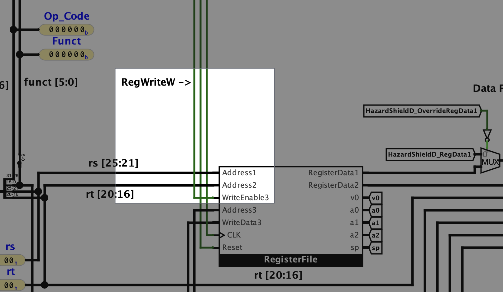
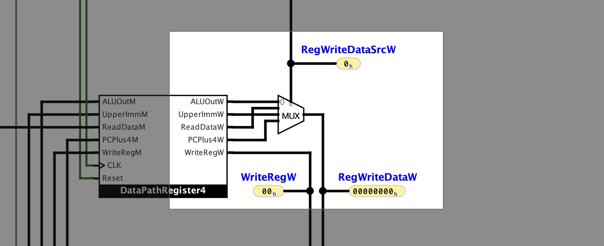

# MainDecoder

## Purpose
TODO

## Outputs

Here is a description of what each output of the MainDecoder does.

### RegWrite

Relevant Pipeline Stages: `(5) Writeback` 
Bit Width: `1` 
Category: `Flag`

This is a flag indicating if an instruction will write to a register during the falling edge of the clock while the
instruction is in pipeline stage `(5) Writeback`.
This flag is passed into the `WriteEnable3` field of the RegisterFile as pictured below:

### RegWriteDataSrc

Relevant Pipeline Stages: `(5) Writeback` 
Bit Width: `2` 
Category: `Multiplexer Control`

This signal controls a multiplexer in pipeline stage `(5) Writeback` that determines the value of `RegWriteDataW`, the
value to be written to the register specified by `WriteRegW`.
The meaning of each value is given by the following table:

|  #   | Purpose                             |
|:----:|:------------------------------------|
| `00` | Sets `RegWriteDataW` to `ALUOutW`   |
| `01` | Sets `RegWriteDataW` to `ReadDataW` |
| `10` | Sets `RegWriteDataW` to `UpperImmW` |
| `11` | Sets `RegWriteDataW` to `PCPlus4W`  |

The function of this multiplexer is pictured below:

## Output Mapping
The key used in the following tables providing the outputs of MainDecoder for varying Op Codes and Funct values.
The numbers at the top of each column indicate which output corresponds to the column's contents.

| # | Value           |
|:-:|:----------------|
| 1 | RegWrite        |
| 2 | RegWriteDataSrc |
| 3 | MemOp           |
| 4 | BranchOp        |
| 5 | ALUOp           |
| 6 | ALUSrcA         |
| 7 | ALUSrcB         |
| 8 | WriteRegSrc     |

### Op Codes

| #  |    OP    | Instruct. |  1  |  2   |   3    |  4   |   5    |  6  |  7   |  8  |
|:--:|:--------:|:---------:|:---:|:----:|:------:|:----:|:------:|:---:|:----:|:---:|
| 00 | `000000` | `R-Type`  | `1` | `00` | `0000` | `00` | `1000` | `0` | `00` | `1` |
| 01 | `000001` |   `N/A`   |     |      |        |      |        |     |      |     |
| 02 | `000010` |    `j`    | `0` | `00` | `0000` | `10` | `0000` | `0` | `00` | `0` |
| 03 | `000011` |   `jal`   | `1` | `11` | `0000` | `10` | `0000` | `0` | `00` | `0` |
| 04 | `000100` |   `beq`   | `0` | `00` | `0000` | `01` | `0000` | `0` | `00` | `0` |
| 05 | `000101` |   `bne`   | `0` | `00` | `0000` | `01` | `0000` | `0` | `00` | `0` |
| 06 | `000110` |  `blez`   | `0` | `00` | `0000` | `11` | `0000` | `0` | `00` | `0` |
| 07 | `000111` |  `bgtz`   | `0` | `00` | `0000` | `11` | `0000` | `0` | `00` | `0` |
| 08 | `001000` |  `addi`   | `1` | `00` | `0000` | `00` | `0000` | `0` | `01` | `0` |
| 09 | `001001` |  `addiu`  | `1` | `00` | `0000` | `00` | `0001` | `0` | `01` | `0` |
| 10 | `001010` |  `slti`   | `1` | `00` | `0000` | `00` | `0011` | `0` | `01` | `0` |
| 11 | `001011` |  `sltiu`  | `1` | `00` | `0000` | `00` | `0100` | `0` | `01` | `0` |
| 12 | `001100` |  `andi`   | `1` | `00` | `0000` | `00` | `0101` | `0` | `10` | `0` |
| 13 | `001101` |   `ori`   | `1` | `00` | `0000` | `00` | `0110` | `0` | `10` | `0` |
| 14 | `001110` |  `xori`   | `1` | `00` | `0000` | `00` | `0111` | `0` | `10` | `0` |
| 15 | `001111` |   `lui`   | `1` | `10` | `0000` | `00` | `0000` | `0` | `00` | `0` |
| 16 | `010000` |   `N/A`   |     |      |        |      |        |     |      |     |
| 17 | `010001` |   `N/A`   |     |      |        |      |        |     |      |     |
| 18 | `010010` |   `N/A`   |     |      |        |      |        |     |      |     |
| 19 | `010011` |   `N/A`   |     |      |        |      |        |     |      |     |
| 20 | `010100` |   `N/A`   |     |      |        |      |        |     |      |     |
| 21 | `010101` |   `N/A`   |     |      |        |      |        |     |      |     |
| 22 | `010110` |   `N/A`   |     |      |        |      |        |     |      |     |
| 23 | `010111` |   `N/A`   |     |      |        |      |        |     |      |     |
| 24 | `011000` |   `N/A`   |     |      |        |      |        |     |      |     |
| 25 | `011001` |   `N/A`   |     |      |        |      |        |     |      |     |
| 26 | `011010` |   `N/A`   |     |      |        |      |        |     |      |     |
| 27 | `011011` |   `N/A`   |     |      |        |      |        |     |      |     |
| 28 | `011100` |   `N/A`   |     |      |        |      |        |     |      |     |
| 29 | `011101` |   `N/A`   |     |      |        |      |        |     |      |     |
| 30 | `011110` |   `N/A`   |     |      |        |      |        |     |      |     |
| 31 | `011111` |   `N/A`   |     |      |        |      |        |     |      |     |
| 32 | `100000` |   `lb`    | `1` | `01` | `0000` | `00` | `0000` | `0` | `01` | `0` |
| 33 | `100001` |   `lh`    | `1` | `01` | `0001` | `00` | `0000` | `0` | `01` | `0` |
| 34 | `100010` |   `lwl`   | `1` | `01` | `0110` | `00` | `0000` | `0` | `01` | `0` |
| 35 | `100011` |   `lw`    | `1` | `01` | `0010` | `00` | `0000` | `0` | `01` | `0` |
| 36 | `100100` |   `lbu`   | `1` | `01` | `0100` | `00` | `0000` | `0` | `01` | `0` |
| 37 | `100101` |   `lhu`   | `1` | `01` | `0101` | `00` | `0000` | `0` | `01` | `0` |
| 38 | `100110` |   `lwr`   | `1` | `01` | `0111` | `00` | `0000` | `0` | `01` | `0` |
| 39 | `100111` |   `N/A`   |     |      |        |      |        |     |      |     |
| 40 | `101000` |   `sb`    | `0` | `00` | `1000` | `00` | `0000` | `0` | `01` | `0` |
| 41 | `101001` |   `sh`    | `0` | `00` | `1001` | `00` | `0000` | `0` | `01` | `0` |
| 42 | `101010` |   `swl`   | `0` | `00` | `1110` | `00` | `0000` | `0` | `01` | `0` |
| 43 | `101011` |   `sw`    | `0` | `00` | `1010` | `00` | `0000` | `0` | `01` | `0` |
| 44 | `101100` |   `N/A`   |     |      |        |      |        |     |      |     |
| 45 | `101101` |   `N/A`   |     |      |        |      |        |     |      |     |
| 46 | `101110` |   `swr`   | `0` | `00` | `1111` | `00` | `0000` | `0` | `01` | `0` |
| 47 | `101111` |  `cache`  |     |      |        |      |        |     |      |     |
| 48 | `110000` |   `ll`    |     |      |        |      |        |     |      |     |
| 49 | `110001` |  `lwc1`   |     |      |        |      |        |     |      |     |
| 50 | `110010` |  `lwc2`   |     |      |        |      |        |     |      |     |
| 51 | `110011` |  `pref`   |     |      |        |      |        |     |      |     |
| 52 | `110100` |   `N/A`   |     |      |        |      |        |     |      |     |
| 53 | `110101` |  `ldc1`   |     |      |        |      |        |     |      |     |
| 54 | `110110` |  `ldc2`   |     |      |        |      |        |     |      |     |
| 55 | `110111` |   `N/A`   |     |      |        |      |        |     |      |     |
| 56 | `111000` |   `sc`    |     |      |        |      |        |     |      |     |
| 57 | `111001` |  `swc1`   |     |      |        |      |        |     |      |     |
| 58 | `111010` |  `swc2`   |     |      |        |      |        |     |      |     |
| 59 | `111011` |   `N/A`   |     |      |        |      |        |     |      |     |
| 60 | `111100` |   `N/A`   |     |      |        |      |        |     |      |     |
| 61 | `111101` |  `sdc1`   |     |      |        |      |        |     |      |     |
| 62 | `111110` |  `sdc2`   |     |      |        |      |        |     |      |     |
| 63 | `111111` |   `N/A`   |     |      |        |      |        |     |      |     |
