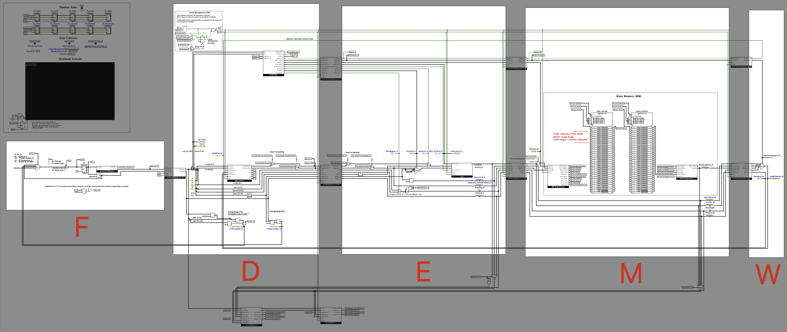

# Pipeline Overview

With the major components of the LogiSpim processor established, this chapter explores how they interact.
In doing so, this chapter provides an in-depth explanation behind the operations of each stage of the processor's pipeline.

As mentioned in [the introduction](../01_intro/1_1_what_is_logispim.md), LogiSpim's pipeline follows the standard
5-stage MIPS pipeline.

Each subchapter explores the implementation of each stage and how it comes together in the main circuit of LogiSpim.
As a whole, it helps users break down the main circuit into its stages, as well as the roles found in each stage.

